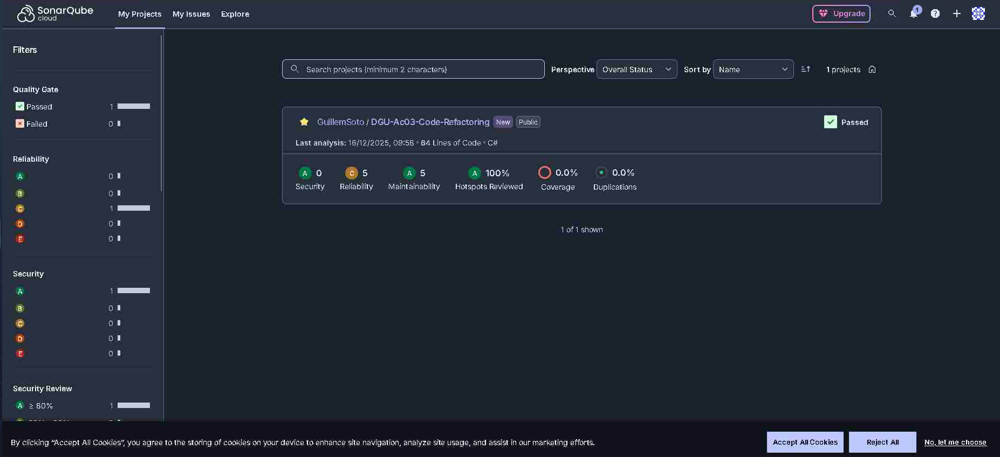
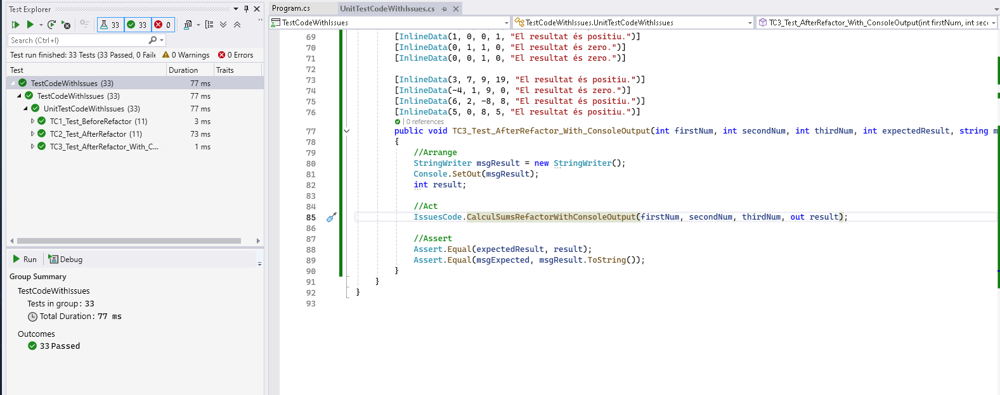
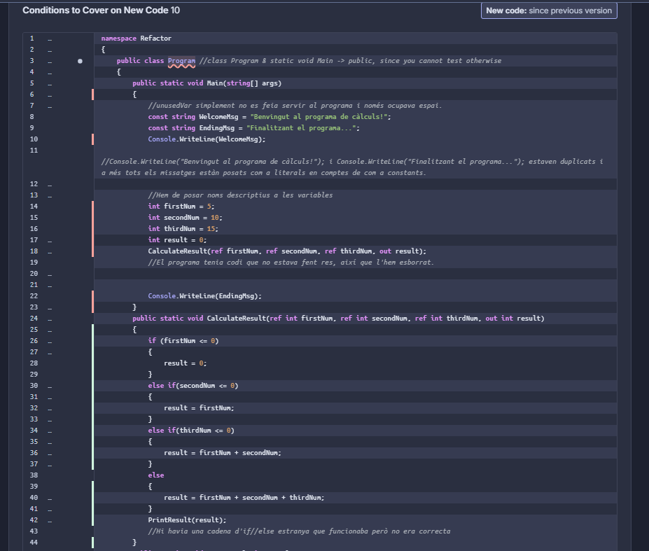
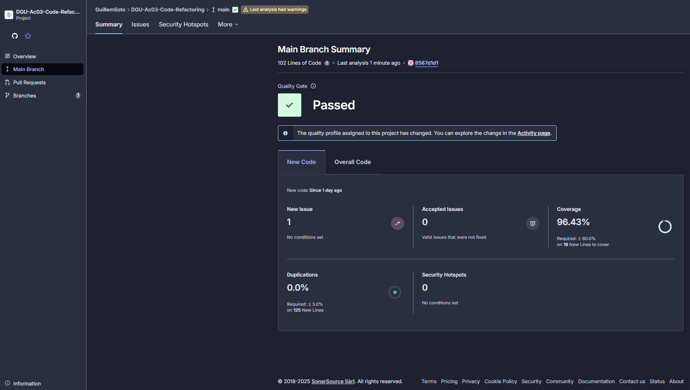
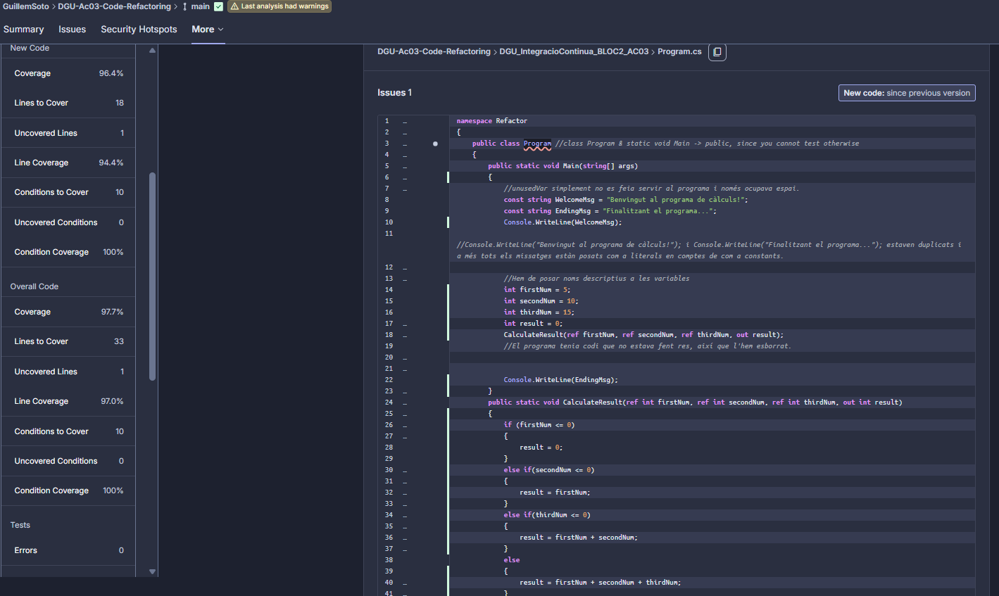

# 1. SonarCloud

---

### Pregunta 1
**En aquest anàlisi inicial del programa, es mostren resultats en l’apartat de cobertura de codi (coverage)? Raoneu la vostra resposta, incloent una captura de la pantalla de resum de SonarCloud.**  

En aquest anàlisi incial encara no es mostren els resultats respecte a la cobertura de codi es a dir, el coverage. De moment el nostre projecte només conté el Program.cs amb el codi però sense cap test realitzat (xUnit o MSTest, per exemple), per tant, no podrem generar el coverage sense abans implementar tests al nostre projecte.



# 2. Refactoring del codi

---

### Pregunta 2
**Quines accions heu realitzat per reduir la complexitat ciclomàtica?  Raoneu la vostra resposta.**

Primer hem canviat l'accés de class Program & static void Main a public, ja que si no es fa no pots testejar el codi.
Després hem tret unusedVar i una part del codi cap al final ja que cap dels dos fragments estava fent res.
Console.WriteLine("Benvingut al programa de càlculs!") i Console.WriteLine("Finalitzant el programa...") estaven duplicats i a més tots els missatges estaven posats com a literals en comptes de com a constants, així que també ho hem canviat.
Després d'això hem posat a les variables a, b i c els noms firstNum, secondNum i thirdNum, ja que aquests són més descriptius.
Una vegada tot fet hem passat gran part del codi a una funció separada i arreglat una cadena d'ifs que no era agradable ni eficient i l'hem passat a una cadena d'else if i a un switch respectivament.
Per últim, hem separat la funció que calcula el resultat de la que el printa per tal de tenir un codi més modular

# 3. Jocs de prova

---

- Si a > 0, b > 0 i c > 0, el resultat és **a + b + c**.
- Si a > 0, b > 0 i c ≤ 0, el resultat és **a + b**.
- Si a > 0 i b ≤ 0, el resultat és **a**.
- Si a ≤ 0, el resultat és **0**.
- Si el resultat és **0**, mostra:  
  > "El resultat és zero."
- Si el resultat és **> 0**, mostra:  
  > "El resultat és positiu."
- Si el resultat és **< 0**, mostra:  
  > "El resultat és negatiu."

## Casos de prova

| Cas  | Descripció | Entrada | Accions | Resultat Esperat | Resultat obtingut |
|-----|------------|---------|---------|------------------|-------------------|
| CP01 | Comprovar que si tots els valors<br>són 0 el resultat sigui 0. | a=0;<br>b=0;<br>c=0; | Passar 0 a tots els valors d'entrada | "El resultat és zero.",<br>resultat=0 | |
| CP02 | Comprovar que si tots els valors<br>són majors a 0 el resultat sigui a+b+c. | a=3;<br>b=7;<br>c=9; | Passar 3, 7 i 9 respectivament als valors d'entrada | "El resultat és positiu.",<br>resultat=19 | |
| CP03 | Comprovar que si posem "a" com un<br>valor negatiu el resultat serà 0. | a=-4;<br>b=0;<br>c=9; | Passar -4, 0 i 9 respectivament als valors d'entrada | "El resultat és zero.",<br>resultat=0 | |
| CP04 | Comprovar que si a i b són positius i<br>c no, el resultat sigui a + b. | a=6;<br>b=2;<br>c=-8; | Passar 6, 2 i -8 respectivament als valors d'entrada | "El resultat és positiu.",<br>resultat=8 | |
| CP05 | Comprovar que si només a és positiu<br>el resultat sigui a. | a=5;<br>b=0;<br>c=-8; | Passar 5, 0 i -8 respectivament als valors d'entrada | "El resultat és positiu.",<br>resultat=5 | |

---

### Pregunta 3
**Com separaríeu la lògica de càlcul en mètodes independents? Raoneu la vostra resposta.**
Hauria d'haver un mètode que llegeixi cada número, un que comprovi quina condició es compleix (És a dir, que comprovi si a>0, b>0, etc) i un que retorni el valor de resultat per cada càlcul possible, per exemple un retornarà a+b+c (si tots son positius), un altre retornarà 0 (si a és negatiu) o un altre retornarà a.
Aquesta solució intenta modular el codi el màxim possible per tal que sigui escal·lable en el futur.

# 4. Implementar Tests Unitaris

---

### Pregunta 4
**Es poden passar tots els tests correctament? Com es captura la sortida per consola? Raoneu la vostra resposta i poseu algun exemple on ho heu implementat.**

En l'image es testega el codi senes refactoritzar i el codi refactoritzat passant-hi els mateixos valors. Tots els tests s'han passat correctament.

Per capturar la sortida per consola hem utilitzat dos metodes diferents. 
- En el primer, en comptes de printar el missatge, s'ha emagatzemat aquest en una variable del tipus string i s'ha comprovat el resultat.
- En el segon, el metode si que printa el missatge, i en comptes d'utilitzar una variable en el test per emagatzemar el missatge i despres comprovar-lo s'ha fet el seguent codi, en el que s'emagatzema l'output (Console.WriteLine) en la variable msgResult i despres es comprova que sigui correcte: 
```
public void TC3_Test_AfterRefactor_With_ConsoleOutput(int firstNum, int secondNum, int thirdNum, int expectedResult, string msgExpected)
{
    //Arrange
    StringWriter msgResult = new StringWriter();
    Console.SetOut(msgResult);
    int result;

    //Act
    IssuesCode.CalculSumsRefactorWithConsoleOutput(firstNum, secondNum, thirdNum, out result);

    //Assert
    Assert.Equal(expectedResult, result);
    Assert.Equal(msgExpected, msgResult.ToString());
}
```

# 5. Anàlisi final SonarCloud

---

### Pregunta 5
**Quin error ha estat més difícil/complex de solucionar? Raoneu la vostra resposta i poseu algun exemple on ho heu implementat.**  



El més difícil ha estat al principi referenciar el arxiu ".csproj" dels tests unitaris en el workflow ".yml". Un cop resolt aquest problema el següent error que va sortir va ser en el SonarCube.  

L'error (segons ChatGPT) es deu al fet que certes lines del codi del "Program.cs" no són testejats per tant, com es veu en la imatge d'adalt el *coverage* només arriba a un 75%, abaix del mínim. En el nostre cas, certes lineas de codi com la linea amb el "default" o els "Console.WriteLine" del metode Main han de ser testejats perquè deixin de sortir en vermell en l'ànalisi (uncovered lines).

ChatGPT va recomanar dues opcions per a que deixes de sortir en vermell en aquestes lines i es poguès realitzar la cobertura de lineas o coverage de manera correcta. La primera opció era separar tota la lógica del Main i posar-la en un altre mètode del qual haurem de fer un test unitari d'aquest, en canvi la segon opció era afegir un linea de codi al arxiu ".yml" de la carpeta Workflows per tal de ignorar el arxiu "Program.cs".  

Finalment, vam decidir no tocar cap línea del Main i es va adaptar el Unit Test que l'IA va proporcionar per així cobrir aquestes línies de codi que no eren testejades, test implementat en **"TestRefactor.cs"**:
```
public void TC3_Test_FunctionMain_PrintMessages()
{
    // Arrange
    var output = new StringWriter();
    Console.SetOut(output);

    // Act
    Program.Main(Array.Empty<string>());

    // Assert
    string result = output.ToString();

    Assert.Contains("Benvingut al programa de càlculs!", result);
    Assert.Contains("El resultat és positiu.", result);
    Assert.Contains("Finalitzant el programa...", result);
}
```
Com a resultat final ara quan es feia l'anàlisi al SonarCloud ja no sortia *coverage* amb un 75%  sinó amb un 96%, ara gaire bé totes les linies de codi del programa estaven cobertes (a excepció del default). Aquest resultat es pot veure en les imatges adjuntes a baix.

  


